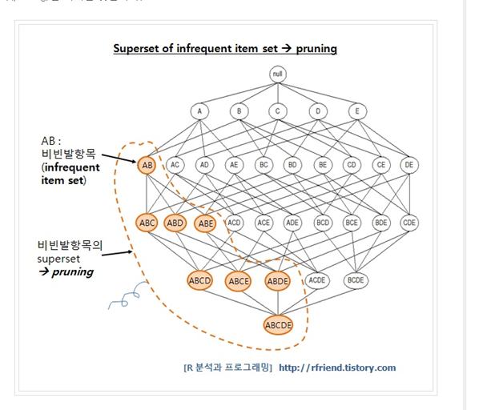

# AI-Hackathon
앵커밸류 FINTECH-AI 해커톤


## 💛 FinOkeYo
### 동호회 및 단체 소비데이터를 활용한 머신러닝 & Open API 기반의 카드 추천 서비스
- 핀오키오는 개인이 아닌 "단체" 를 위한 서비스를 기획하였습니다.
- 동호회나, 단체모임의 소비패턴 분석하여 카드추천과, 필요 서비스를 제공하고자 합니다. 

---

# 카드 추천 알고리즘

## 📌 금융 결제원 API 결제 내역을 통한 카드추천방식

### **1.** **어떤 알고리즘을** 썼나?

장바구니분석이라 불리우는 연관 규칙을 이용하고 `Apriori algorithm`을 사용함.

#### **Aproiori** **알고리즘 원리**

- 최소지지도 이상을 갖는 항목집합 = 빈발항목집합(frequent item set)

- 이러한 모든 항목집합에 대한 지지도를 계산하는 대신에 최소 지지도 이상의 빈발항목집합만을 찾아내 연관규칙을 계산함

  

#### **빈발항목집합의 후보를 생성하고** **연관규칙을** **도출하는** **Apriori** algorithm 

- 빈발항목집합의 후보(candidates list)를 생성하고, 연관규칙을 생성 후 최소신뢰도 기준 (minimun confidence criteria)를 적용해서 최소 신뢰도에 미달하는 연관규칙은 제거(pruning)하게 되는데, 이러한 반복(iteration) 작업을 새로운 연관규칙이 없을 때 까지 하는 알고리즘

### 2.평가 척도는?

- #### 지지도

  전체 거래항목 중 상품 A와 상품 B를 동시에 포함하여 거래하는 비율

  A -> B 라고 하는 규칙이 전체 거래 중 차지하는 비율을 통해 해당 연관 규칙이 얼마나 의미가 있는 규칙인지 확인

  지지도 = P(A∩B)  :  A와 B가 동시에 포함된 거래 수 / 전체 거래 수

- #### 신뢰도

  상품 A를 포함하는 거래 중 A와 B가 동시에 거래되는 비중

  상품 A를 구매 했을 때 상품 B를 구매할 확률이 어느정도 되는지 확인

  신뢰도 = P(A∩B) / P(A)  :  A와 B가 동시에 포함된 거래 수 / A가 포함된 거래 수

- #### 향상도

  상품 A의 거래 중 항목 B가 포함된 거래의 비율 / 전체 상품 거래 중 상품 B가 거래된 비율

  (A가 주어지지 않았을 때 B의 확률 대비 A가 주어졌을 때 B의 확률 증가 비율)

  향상도 = P(A∩B) / P(A)*P(B)  = P (B|A) / P (B)

  :  A와 B가 동시에 일어난 횟수 / A, B가 독립된 사건일 때 A,B가 동시에 일어날 확률

  // A, B 연관성이 높아지면 향상도가 1보다 큼 1이면 관련 없음

### 3. 왜 이 알고리즘을 썼나?

- 회비를 결제 할 당시의 결제 내역을 바탕으로 동아리 활동(결제)을 하고 커피를 마실 수도 있고, 회식을 하거나 할 수 있으므로 모임 당시 소비 패턴을 쉽게 알수 있을 것이라 생각하였고, 그에 상응하는 혜택이 주어지는 카드를 추천한다면 사용자가 만족할것이라 예상

- 고객의 대규모 거래데이터로부터 함께 구매가 발생하는 규칙을 도출하여, 고객이 특정 상품 구매 시 이와 연관성 높은 카드 상품을 추천할 수 있을 것이라 예상

## 📌 카드 평점 등록을 기반으로 한 추천 방식

### 1. 어떤 알고리즘을 썼나?

- SVD를 활용한 아이템 기반 협업 필터링 적용

- 행렬 축소 기법 중 하나인 SVD(특잇값 분해)를 이용

### 2. SVD를 사용한 이유는?

- 추천 분야에서 SVD는 거대한 행렬을 축소가능 
- 축소된 행렬에서 확연히 줄어든 계산량으로 사용자 또는 아이템 간의 유사도를 구할수있게함
- 계산량을 줄여주고, 정확도는 기본적인 협업필터링 보다 우수

### 3. 과정

1. 아이템 nn에 대한 사용자 mm들의 평점을 가진 행렬 m×n 을 정의

2. 특잇값 분해(SVD) 하여 다음 처럼 만든다. Rnorm=U⋅S⋅VT .

3. 차원 축소 단계를 진행하는데, k대각 원소를 가진 S (k×k) 행렬을 가져오면서 UU와 VTVT 도 각각(m×k)(m×k) 으로 만든다.

4. 사용자 ui가 아이템 ij에 할당한 "메타" 평점

5. 아이템 ij와 if 간의 유사도를 조정된 코사인 유사도를 사용하여 구한다.

6. 다음의 가중 합으로 예측치를 생성한다. 이는 아이템 ijij에 대한 사용자 ua에 대한 예측치를 계산하는 것을 말한다.

7. 해당 아이템 ij와 가장 유사한 것으로 선택된 l 아이템들에 대해 해당 사용자가 평가한 등급에 대한 예측을 기반으로 한다는 점에서 일반적인 아이템 기반 필터링과 사용하는 방정식이 유사

 ```k : 행렬 수(요인) n : 계산반복횟수 높은 k를 선택하면 R에 가까운 근사치를 얻을 수 있다. 반면에, 더 작은 k를 선택하면 더 많은 일을 절약할 수 있을 것```

#### 4. Cold Start?

기본 데이터들이 없으면 새로 나온 카드들을 추천하는 방향으로 제공. 혹은, 카드사 추천 카드 정보를 제공
